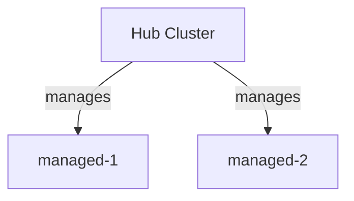
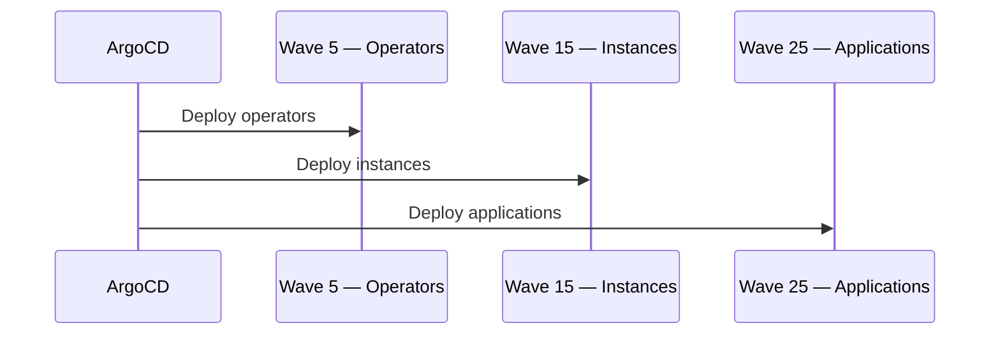

# {CLUSTER_NAME} — Low-Level Design Document

| Field | Value |
|-------|-------|
| **Cluster** | {CLUSTER_NAME} |
| **Role** | {ROLE} |
| **OCP Version** | {OCP_CHANNEL} |
| **Date** | {DATE} |
| **Generated From** | GitOps repository (virtualization-migration-factory) |

---

## Executive Summary

{2-3 paragraphs: cluster purpose, role in fleet, management model, key capabilities}

---

## Multi-Cluster Architecture

{Fleet topology description, hub/spoke relationships}

---

## Cluster Identity

| Property | Value |
|----------|-------|
| Name | {name} |
| Role | {hub/managed} |
| OCP Channel | {channel} |
| Git Version Pin | {pin} |
| Groups | {list} |

---

## Compute & Node Inventory

| Hostname | Role | BMC Address | Boot MAC | Status |
|----------|------|-------------|----------|--------|
| {per node row} | | | | |

---

## Networking

### Installation Network

{Bonding, VLANs, IP scheme, DNS}

### Day-2 Network Configuration

{OVS bridges, bridge-mappings, localnet}

### Network Summary

| Interface | Purpose | Subnet | VLAN |
|-----------|---------|--------|------|
| {rows} | | | |

---

## Storage

| StorageClass | Provisioner | Backend | Default Virt | Expansion |
|--------------|-------------|---------|--------------|-----------|
| {rows} | | | | |

---

## Installation Method

{Agent-based install description, BMC protocol, boot method}

---

## Operator Stack

| Operator | Package | Channel | Source | Wave | Upgrade |
|----------|---------|---------|--------|------|---------|
| {rows sorted by wave} | | | | | |

---

## Observability

{Monitoring stack description, custom configs}

---

## Authentication & Authorization

| Provider | Type | Notes |
|----------|------|-------|
| {rows} | | |

---

## Cluster Upgrades

{Channel, strategy, operator upgrade policies}

---

## Component Deployment Sequence

{Full component list by sync-wave, Mermaid sequence diagram}

---

## Design Decisions

| ID | Topic | Decision | Rationale |
|----|-------|----------|-----------|
| DD-01 | {topic} | {decision} | {rationale} |

---

## References

- [OpenShift Container Platform {version} Documentation](https://docs.redhat.com/en/documentation/openshift_container_platform/{version})
- [OpenShift Virtualization](https://docs.redhat.com/en/documentation/openshift_container_platform/{version}/html/virtualization)
- [Red Hat Advanced Cluster Management](https://docs.redhat.com/en/documentation/red_hat_advanced_cluster_management_for_kubernetes)
- [NetApp Astra Trident](https://docs.netapp.com/us-en/trident/)
