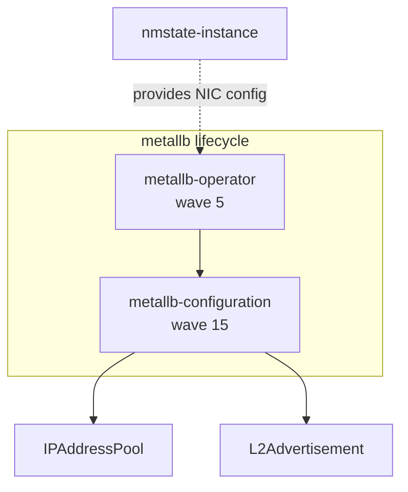
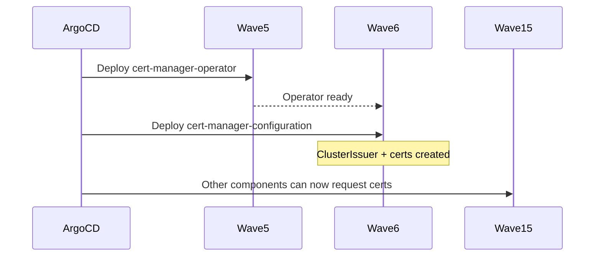

# Overview

Produce a clear explanation of what a fleet component does, how it's configured, and how it relates to sibling components. Act as a senior platform engineer who knows this GitOps repo's architecture deeply. The output is an explanation in chat plus a `readme.md` conforming to the canonical template, offered for approval before writing.

**Args:** `<component-name>` — any part of a lifecycle group (e.g. `metallb`, `metallb-operator`, or `metallb-configuration` all resolve to the same group).

## Resolution rules

- `{fleet-common}` → `.skills/fleet-common` (shared scripts, references).
- `{project-root}` → the project working directory.
- `{skill-root}` → this skill's installed directory.

## On Activation

1. Run `python {fleet-common}/scripts/find_component_siblings.py <component-name> --repo-root {project-root}` to resolve the lifecycle group. If it returns an error, tell the user the component wasn't found and list similar names from `python {fleet-common}/scripts/resolve_repo_structure.py --repo-root {project-root}`.

2. If the component has an operator-policy, run `python {fleet-common}/scripts/parse_operator_policy.py <component-name> --repo-root {project-root}` to extract operator metadata.

3. Read all YAML manifests in each part directory (`components/<part>/`). Understand what Kubernetes resources are created.

4. Load `{fleet-common}/references/fleet-repo-structure.md` as architectural context.

## Explanation

With the script outputs and manifest contents, produce:

### Product Identification

Map the component to its upstream project. Sources for the mapping:
- OperatorPolicy `subscription.name` and `subscription.source` identify the operator package
- Namespace naming and CRD groups identify the product family
- Known mappings for this repo: `nmstate-operator` → Kubernetes NMState, `mtv-operator` → Migration Toolkit for Virtualization, `acm-operator` → Red Hat Advanced Cluster Management, `trident-operator` → NetApp Astra Trident, `odf-operator` → OpenShift Data Foundation

Web-search for the upstream project documentation and Red Hat product docs to ground the explanation in authoritative sources.

### Component Description

Explain:
- What the product/project does (from upstream docs, 2-3 sentences)
- Which lifecycle parts are deployed and what each contributes
- Key configuration choices: what CRs are created, significant values set, what's commented-out as available options
- Which clusters use this component (from the siblings script output)
- Sync-wave placement and its rationale (why this wave, what depends on it)

### Diagrams

Generate Mermaid diagrams when they add clarity:

**Architecture diagram** — show the component's lifecycle parts, the Kubernetes resources each creates, and relationships to other components:

**Sequence diagram** — when the component has multiple parts or meaningful ordering dependencies, show the sync-wave deployment sequence:

Only produce diagrams that illuminate non-obvious relationships. A single-part component with no dependencies needs no diagram.

### Readme Generation

After presenting the explanation, check if the component has a `readme.md`:
- If it exists, compare your findings against it. If outdated or incomplete, propose an update showing the diff.
- If none exists, generate one following the template at `{fleet-common}/references/readme-template.md`.

Include the Mermaid diagrams in the readme itself (not only in chat) — they are documentation, not ephemeral explanation. Present the proposed readme and ask for approval before writing to `components/<part>/readme.md` (place it in the part that has the most configuration context — typically the `-configuration` or `-instance` part, or the base component if standalone).

## Gotchas

- Some components exist in `components/` but aren't referenced by any active values.yaml entry — they're available inventory. Report this rather than assuming it's an error.
- The `gitops-boostrap-policy` name is a known typo — don't flag it.
- Components with `acm-` prefix: `acm-operator` and `acm-instance` are the core ACM deployment; `acm-configuration` is provisioning config; `acm-observability` is a separate concern (multi-cluster monitoring); `acm-fusion-dr` is disaster recovery. Don't conflate them.
- `openshift-virtualization-operator` creates the operator, but the instance part is named `openshift-virtualization-instance` and deploys a `HyperConverged` CR — the naming is misleading without context.
- Trident has three tiers: `trident-operator`, `trident-instance`, `trident-configuration` — plus separate `trident-protect-*` components that are a different product (Trident Protect, not Astra Trident).
