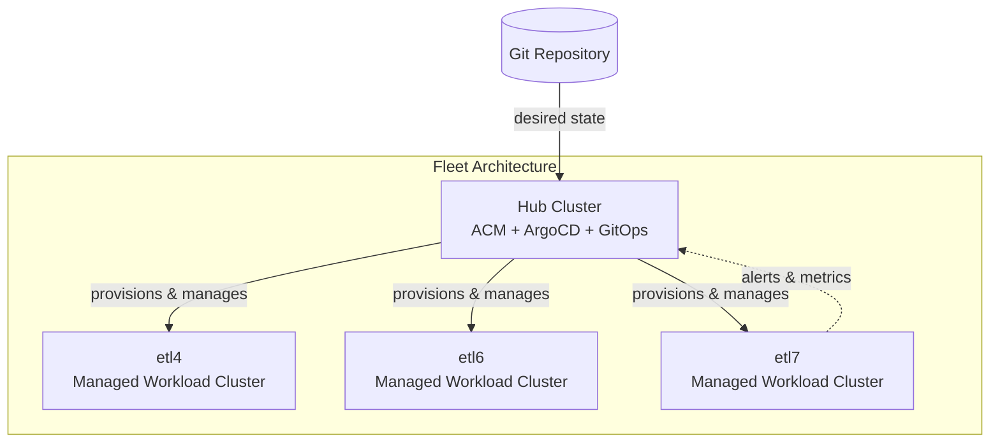
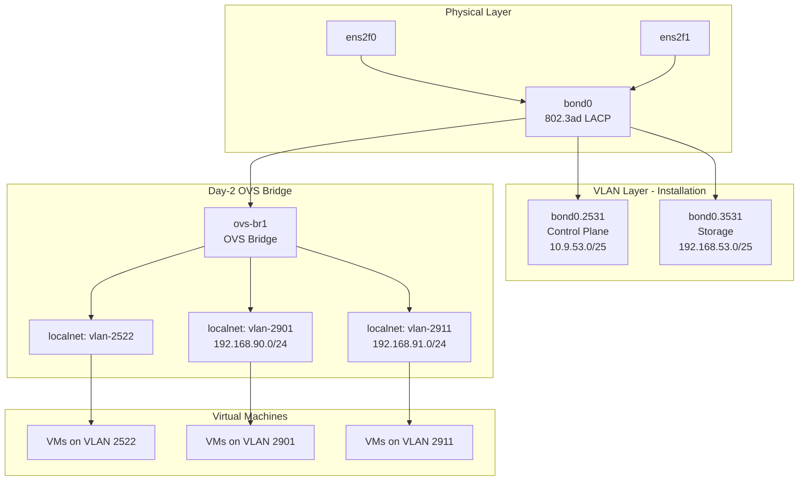
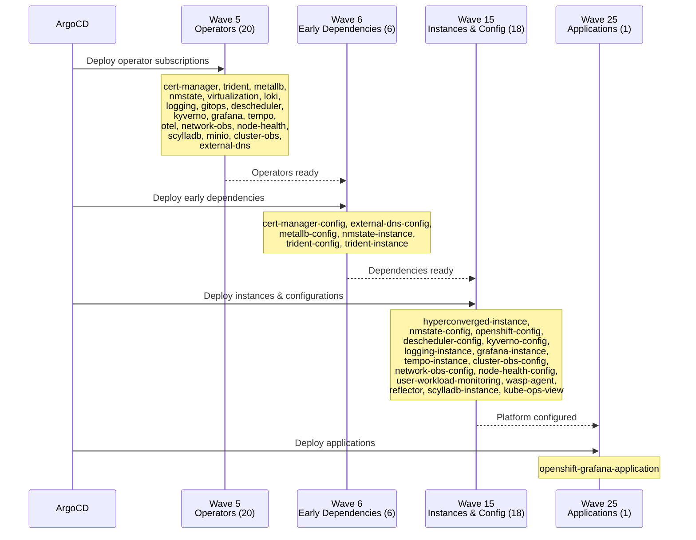

# ETL7 — Low-Level Design Document

| Field | Value |
|-------|-------|
| **Cluster** | etl7 |
| **Role** | Managed (OpenShift Virtualization workload cluster) |
| **OCP Version** | 4.22.8 (stable-4.22 channel) |
| **Date** | August 15, 2026 |
| **Generated From** | GitOps repository — virtualization-migration-factory |
| **Domain** | etl7.ocp.rht-labs.com |

---

## Executive Summary

The **etl7** cluster is a compact, bare-metal OpenShift Virtualization workload cluster running Red Hat OpenShift Container Platform 4.22. It operates as an ACM-managed cluster within a multi-cluster fleet governed by GitOps (ArgoCD) from a centralized hub cluster.

The cluster is purpose-built for running virtual machine workloads using OpenShift Virtualization (KubeVirt), backed by NetApp ONTAP-SAN block storage via Astra Trident. With 3 converged master/worker nodes (HPE ProLiant DL380 Gen9), it runs a full production-grade operator stack including high-availability features (Node Health Check, Descheduler), comprehensive observability (Prometheus, Loki, Grafana, OpenTelemetry, Network Observability), and policy enforcement (Kyverno).

All cluster configuration is declared in Git and delivered through ArgoCD using the app-of-apps pattern. Operator lifecycle management is handled via ACM OperatorPolicy resources, providing centralized governance over operator installation, upgrade channels, and version pinning.

---

## Multi-Cluster Architecture

The etl7 cluster is part of a 4-cluster fleet managed by a centralized hub:

| Cluster | Role | Groups | Nodes |
|---------|------|--------|-------|
| **hub** | Hub (ACM + ArgoCD control plane) | all | — |
| **etl4** | Managed (workload) | all, prod | dl380g9-1, dl380g9-2, dl380g9-3 |
| **etl6** | Managed (workload) | all, prod | dl380g9-5, dl380g9-6, dl380g9-7 |
| **etl7** | Managed (workload) | all, prod | dl380g9-8, dl380g9-9, dl380g9-10 |

### Fleet Governance Model

- **Hub cluster** runs Red Hat Advanced Cluster Management (ACM) and ArgoCD, provisioning and managing all spoke clusters.
- **GitOps delivery:** The hub's ArgoCD instance renders each cluster's configuration from the shared Git repository using Kustomize + Helm, delivered through a custom `envsubst` CMP sidecar.
- **Policy-based lifecycle:** Operators are deployed and upgraded via ACM `OperatorPolicy` resources — not traditional OLM Subscriptions — enabling centralized version control and upgrade approval across the fleet.
- **Monitoring federation:** Prometheus on etl7 forwards alerts to the hub's ACM Observability Alertmanager (`alertmanager-open-cluster-management-observability.apps.hub2.ocp.rht-labs.com`).

---

## Cluster Identity

| Property | Value |
|----------|-------|
| Name | etl7 |
| Role | Managed (spoke) |
| OCP Version | 4.22.8 |
| Update Channel | stable-4.22 |
| Git Version Pin | main |
| Domain | etl7.ocp.rht-labs.com |
| Groups | `all` (base infrastructure), `prod` (virtualization + HA + observability) |
| Active Components | 48 |
| Commented-Out (Available) | Additional components available but not enabled |

### Group Contributions

| Group | What it provides |
|-------|------------------|
| **all** | Base infrastructure: GitOps operator, cert-manager, external-dns, MetalLB, NMState, Trident storage, Loki logging, MinIO (log storage), monitoring configuration, kube-ops-view |
| **prod** | Virtualization platform: OpenShift Virtualization, Descheduler, Node Health Check, Kyverno policies, Grafana, Network Observability, OpenTelemetry, Tempo, ScyllaDB, Cluster Observability |

---

## Compute & Node Inventory

### Node Hardware

All nodes are **HPE ProLiant DL380 Gen9** rack servers operating in a **compact/converged configuration** — all 3 nodes serve as both control plane (master) and worker nodes. This means the cluster does not have dedicated infrastructure nodes; platform services and workloads share the same compute.

| Hostname | FQDN | Role | BMC Address | Boot MAC | Status |
|----------|------|------|-------------|----------|--------|
| dl380g9-8 | dl380g9-8.etl7.ocp.rht-labs.com | master | redfish://10.9.48.218 | 00:11:0a:6b:b5:40 | Online |
| dl380g9-9 | dl380g9-9.etl7.ocp.rht-labs.com | master | redfish://10.9.48.219 | 00:11:0a:6a:65:b8 | Online |
| dl380g9-10 | dl380g9-10.etl7.ocp.rht-labs.com | master | redfish://10.9.48.220 | 00:11:0a:68:06:4c | Online |

### NIC Inventory (per node)

| Interface | Type | MAC Address (dl380g9-8) | State | Purpose |
|-----------|------|-------------------------|-------|---------|
| ens2f0 | Ethernet | 00:11:0a:6b:b5:40 | up | Bond member (primary) |
| ens2f1 | Ethernet | 00:11:0a:6b:b5:41 | up | Bond member |
| eno1 | Ethernet | 30:e1:71:6f:c8:30 | up | Reserved/unused |
| eno2 | Ethernet | 30:e1:71:6f:c8:31 | down | Unused |
| eno3 | Ethernet | 30:e1:71:6f:c8:32 | down | Unused |
| eno4 | Ethernet | 30:e1:71:6f:c8:33 | down | Unused |

### Compute Notes

- **Masters schedulable:** All 3 nodes carry the `master` role in a compact 3-node deployment, meaning virtual machines are scheduled directly on control plane nodes.
- **No dedicated workers:** This is appropriate for lab/development environments. For production workloads requiring strict separation, dedicated worker nodes should be considered.
- **Live migration:** Supported across all 3 nodes since they share identical hardware (same HPE DL380 Gen9 generation, same CPU model).

---

## Networking

### 6.1 Installation Network

The installation-time network uses bonded interfaces with tagged VLANs for control plane and storage traffic separation.

| Parameter | Value |
|-----------|-------|
| Bond Mode | 802.3ad (LACP) |
| Bond Members | ens2f0, ens2f1 |
| MII Monitor | 100ms |
| Control Plane VLAN | 2531 |
| Control Plane Subnet | 10.9.53.0/25 |
| Default Gateway | 10.9.53.1 (via bond0.2531) |
| Storage VLAN | 3531 |
| Storage Subnet | 192.168.53.0/25 |
| DNS Servers | 10.9.48.31, 10.9.48.32 |
| IP Assignment | Static |

#### Per-Node IP Addressing

| Node | Control Plane IP | Storage IP |
|------|-----------------|------------|
| dl380g9-8 | 10.9.53.18/25 | 192.168.53.18/25 |
| dl380g9-9 | 10.9.53.19/25 | 192.168.53.19/25 |
| dl380g9-10 | 10.9.53.20/25 | 192.168.53.20/25 |

### 6.2 Day-2 Network Configuration

Post-installation, a dedicated OVS bridge is configured for VM traffic, separate from the cluster SDN:

| Parameter | Value |
|-----------|-------|
| Bridge Name | ovs-br1 |
| Bridge Type | OVS (Open vSwitch) |
| Port | bond0 |
| STP | Disabled |
| Node Selector | `node-role.kubernetes.io/worker: ''` (all nodes) |

#### OVN Bridge Mappings

| Localnet Name | Bridge | State | Purpose |
|---------------|--------|-------|---------|
| vlan-2522 | ovs-br1 | present | VM network traffic |
| vlan-2901 | ovs-br1 | present | VM secondary network (192.168.90.0/24) |
| vlan-2911 | ovs-br1 | present | VM tertiary network (192.168.91.0/24) |

#### Network Attachment Definitions (NADs)

| NAD Name | VLAN ID | Type | Namespace | MTU |
|----------|---------|------|-----------|-----|
| vlan-2522 | 2522 | ovn-k8s-cni-overlay (localnet) | default | 1500 |
| vlan-2901 | 2901 | ovn-k8s-cni-overlay (localnet) | default | 1500 |
| vlan-2911 | 2911 | ovn-k8s-cni-overlay (localnet) | default | 1500 |

### 6.3 Load Balancing (MetalLB)

| Parameter | Value |
|-----------|-------|
| IP Address Pool | main-pool |
| Address Range | 10.9.53.32/28 (16 addresses: .32–.47) |
| Mode | L2 (Layer 2 advertisement) |

### 6.4 Cluster Network Configuration

| Parameter | Value |
|-----------|-------|
| SDN | OVN-Kubernetes |
| Route Advertisements | Disabled |
| FRR (BGP) | Available but not enabled (commented out) |

### 6.5 Network Topology Diagram

### 6.6 Available but Inactive (Commented-Out)

- **Infinidat iSCSI storage network:** Per-node Linux bridges on VLAN 2911 for dedicated iSCSI traffic to Infinidat storage (IPs: 192.168.91.8–.10). Currently disabled — available for future Infinidat integration.

---

## Storage

### Storage Backend

| Parameter | Value |
|-----------|-------|
| Vendor | NetApp |
| Product | ONTAP |
| Driver | ontap-san (iSCSI block) |
| CSI Provider | Astra Trident (csi.trident.netapp.io) |
| Management LIF | netapp.etl.rht-labs.com |
| SVM | ocp_e7 |
| Credentials | Managed via Kubernetes Secret (ontap-san-secret) |

### Storage Classes

| StorageClass | Provisioner | Backend | Reclaim | Expansion | Default Virt | Binding |
|--------------|-------------|---------|---------|-----------|--------------|---------|
| **ontap-san** | csi.trident.netapp.io | ontap-san | Delete | Yes | **Yes** | Immediate |
| ontap-nas | csi.trident.netapp.io | ontap-nas | Delete | Yes | No | Immediate |

### Storage Configuration Notes

- **ontap-san** is the default virtualization StorageClass (`storageclass.kubevirt.io/is-default-virt-class: "true"`), meaning all VM disks are provisioned as iSCSI LUNs by default.
- Thin provisioning is enabled, with snapshot and clone support.
- **ontap-nas** is used for infrastructure workloads requiring ReadWriteMany (RWX) access — notably Prometheus persistent storage (100Gi).
- iSCSI block volumes inherently support RWX access mode, enabling VM live migration without additional configuration.

---

## Installation Method

| Parameter | Value |
|-----------|-------|
| Method | ACM Agent-Based Install |
| Provisioning Hub | hub cluster |
| BMC Protocol | Redfish (HPE iLO) |
| Boot Method | Virtual Media (Redfish) |
| Automated Cleaning | Metadata only |
| Infrastructure | BareMetalHost + InfraEnv + AgentClusterInstall |

### How It Works

1. The hub cluster's ACM Multi-Cluster Engine (MCE) provisions etl7 via agent-based installation.
2. `BareMetalHost` custom resources define each node's BMC address and boot MAC.
3. MCE uses Redfish Virtual Media to boot the discovery ISO on each node — no PXE infrastructure required.
4. `NMStateConfig` resources configure static networking (bonds, VLANs, IPs) during installation.
5. Once agents register, `AgentClusterInstall` drives the cluster deployment to completion.
6. Post-install, ArgoCD applies the full operator stack and day-2 configuration from Git.

---

## Operator Stack

All operators are deployed via ACM **OperatorPolicy** resources (not traditional Subscriptions). This provides centralized governance, version pinning, and fleet-wide upgrade coordination.

### Wave 5 — Operators

| Operator | Package | Channel | Source | Namespace | Starting CSV | Upgrade |
|----------|---------|---------|--------|-----------|--------------|---------|
| cert-manager | cert-manager | stable-v1 | certified-operators | cert-manager | cert-manager.v1.16.0 | Automatic |
| cluster-observability | — | — | — | — | — | — |
| **descheduler** | cluster-kube-descheduler-operator | stable | redhat-operators | openshift-kube-descheduler-operator | v5.1.1 | Automatic |
| external-dns | external-dns-operator | stable-v1 | redhat-operators | external-dns-operator | v1.3.0 | Automatic |
| **kyverno** | — | — | — | — | — | — |
| loki | loki-operator | stable-6.6 | redhat-operators | openshift-loki-operator | v6.3.0 | Automatic |
| **metallb** | metallb-operator | stable | redhat-operators | metallb-system | v4.20.0 | Automatic |
| minio | — | — | — | — | — | — |
| **network-observability** | netobserv-operator | stable | redhat-operators | openshift-netobserv-operator | v1.12.0 | Automatic |
| **nmstate** | kubernetes-nmstate-operator | stable | redhat-operators | openshift-nmstate | v4.19.0 | Automatic |
| **node-health-check** | — | — | — | — | — | — |
| openshift-gitops | openshift-gitops-operator | latest | redhat-operators | openshift-gitops-operator | v1.20.4 | Automatic |
| openshift-grafana | — | — | — | — | — | — |
| openshift-logging | cluster-logging | stable-6.6 | redhat-operators | openshift-logging | v6.3.0 | Automatic |
| openshift-tempo | — | — | — | — | — | — |
| **openshift-virtualization** | kubevirt-hyperconverged | stable | redhat-operators | openshift-cnv | v4.20.11 | Automatic |
| otel | — | — | — | — | — | — |
| **scylladb** | scylladb-operator | stable | certified-operators | scylladb | v1.20.2 | Automatic |
| **trident** | trident-operator | stable | certified-operators | netapp-trident | v25.6.1 | Automatic |

### Wave 6 — Early Dependencies

| Component | Purpose |
|-----------|---------|
| cert-manager-configuration | ClusterIssuers and certificates for TLS |
| external-dns-configuration | External DNS record management |
| metallb-configuration | IP address pool (10.9.53.32/28) |
| nmstate-instance | NMState operator instance |
| trident-configuration | ONTAP backend + StorageClass (cluster-specific) |
| trident-instance | Trident orchestrator instance |

### Wave 15 — Instances & Configurations

| Component | Purpose |
|-----------|---------|
| cluster-observability-configuration | Observability stack configuration |
| descheduler-configuration | VM workload rebalancing policies |
| hyperconverged-instance | OpenShift Virtualization HyperConverged CR |
| kube-ops-view | Cluster visualization dashboard |
| kyverno-configuration | Security and compliance policies |
| loki-logging-configuration | Log aggregation configuration |
| network-observability-configuration | Network flow monitoring |
| nmstate-configuration | Day-2 OVS bridges and bridge mappings (cluster-specific) |
| node-health-check-configuration | Node self-healing policies |
| openshift-config | OAuth, console, monitoring, network patches (cluster-specific) |
| openshift-grafana-instance | Grafana dashboards |
| openshift-logging-instance | Log collection and forwarding |
| openshift-tempo-instance | Distributed tracing backend |
| reflector-operator | Cross-namespace ConfigMap/Secret propagation |
| scylladb-instance | ScyllaDB cluster instance |
| user-workload-monitoring | User application metrics collection |
| wasp-agent | VirtIO-fs cache agent for VM performance |

### Wave 25 — Applications

| Component | Purpose |
|-----------|---------|
| openshift-grafana-application | Grafana datasource and dashboard definitions |

---

## Observability

### Monitoring Stack

The etl7 cluster runs a comprehensive observability stack:

| Component | Technology | Purpose |
|-----------|-----------|---------|
| Platform Monitoring | Prometheus + Alertmanager | Core cluster metrics and alerting |
| User Workload Monitoring | Prometheus (user namespaces) | Application-level metrics |
| Logging | Loki + OpenShift Logging | Centralized log aggregation |
| Log Storage | MinIO | S3-compatible object storage for Loki |
| Dashboards | Grafana | Custom visualization and dashboards |
| Network Observability | NetObserv (eBPF) | Network flow analysis and monitoring |
| Distributed Tracing | Tempo + OpenTelemetry | Request tracing across services |
| Cluster Observability | Cluster Observability Operator | Consolidated observability management |

### Prometheus Configuration

| Parameter | Value |
|-----------|-------|
| User Workload Monitoring | Enabled |
| Prometheus Memory Limit | 32Gi |
| Prometheus Memory Request | 8Gi |
| Prometheus Storage | 100Gi (ontap-nas StorageClass) |
| Alertmanager Federation | Hub ACM Observability |
| External Label | managed_cluster: 57ad5a67-2446-457c-992b-a3e05269b7ec |
| Node Exporter Collectors | buddyinfo, cpufreq, ksmd, mountstats, netclass, netdev, processes, systemd, tcpstat |

### Console Plugins

The OpenShift web console is extended with the following plugins:

| Plugin | Purpose |
|--------|---------|
| monitoring-plugin | Enhanced monitoring UI |
| gitops-plugin | ArgoCD integration |
| kubevirt-plugin | VM management |
| nmstate-console-plugin | Network state visibility |
| node-remediation-console-plugin | Node health actions |
| networking-console-plugin | Network configuration |
| logging-view-plugin | Log viewing |
| soteria-console-plugin | Security insights |
| netobserv-plugin | Network flow visualization |

---

## Authentication & Authorization

| Provider | Type | Method |
|----------|------|--------|
| htpasswd | HTPasswd | File-based (htpass-secret) |

### Notes

- The cluster currently uses **HTPasswd** as its sole identity provider. This is typical for lab/development environments.
- For production readiness, integration with an enterprise identity provider (OIDC/Okta, LDAP, or Active Directory) is recommended.
- The htpasswd secret is managed as a Kubernetes Secret referenced by the OAuth CR.
- ArgoCD sync options include `Delete=false` to prevent accidental removal of the OAuth configuration.

---

## Cluster Upgrades

### OpenShift Platform

| Parameter | Value |
|-----------|-------|
| Current Version | 4.22.8 |
| Update Channel | stable-4.22 |
| Desired Update | 4.22.8 (current) |
| Strategy | Declarative via GitOps (ClusterVersion CR in Git) |

### Operator Upgrade Policy

All operators on this cluster are configured with **Automatic** upgrade approval, meaning they will upgrade within their approved version lists without manual intervention.

| Operator | Upgrade Approval | Version Range |
|----------|-----------------|---------------|
| OpenShift Virtualization | Automatic | 4.17.4 → 4.22.2 |
| Trident | Automatic | v25.6.1 → v26.6.0 |
| MetalLB | Automatic | 4.18.0 → 4.22.0 |
| NMState | Automatic | 4.17.0 → 4.22.0 |
| Loki | Automatic | v6.1.1 → v6.6.0 |
| Logging | Automatic | v6.1.1 → v6.6.0 |
| Descheduler | Automatic | v5.1.1 → v5.4.0 |
| External DNS | Automatic | v1.3.0 → v1.3.8 |
| Network Observability | Automatic | v1.12.0 → v1.12.1 |
| GitOps | Automatic | v1.20.4 → v1.21.1 |
| ScyllaDB | Automatic | v1.20.2 (pinned) |

### Upgrade Coordination

Upgrades are managed declaratively:
1. **Platform upgrades** are triggered by updating the `ClusterVersion` CR's `desiredUpdate.version` in Git.
2. **Operator upgrades** are controlled by the `versions[]` list in each OperatorPolicy — only versions in the list are approved.
3. The hub cluster's ACM governance ensures upgrade policies are applied consistently across the fleet.

---

## Component Deployment Sequence

The complete component stack deploys in sync-wave order via ArgoCD:

### Full Component List

| # | Component | Wave | Source | Has Overlay |
|---|-----------|------|--------|-------------|
| 1 | cert-manager-operator | 5 | group:all | No |
| 2 | cluster-observability-operator | 5 | group:all | No |
| 3 | descheduler-operator | 5 | group:prod | No |
| 4 | external-dns-operator | 5 | group:all | No |
| 5 | kyverno-operator | 5 | group:prod | No |
| 6 | loki-operator | 5 | group:all | No |
| 7 | metallb-operator | 5 | group:all | No |
| 8 | minio-operator | 5 | group:all | No |
| 9 | network-observability-operator | 5 | group:prod | No |
| 10 | nmstate-operator | 5 | group:all | No |
| 11 | node-health-check-operator | 5 | group:prod | No |
| 12 | openshift-gitops-operator | 5 | group:all | No |
| 13 | openshift-grafana-operator | 5 | group:prod | No |
| 14 | openshift-logging-operator | 5 | group:all | No |
| 15 | openshift-tempo-operator | 5 | group:prod | No |
| 16 | openshift-virtualization | 5 | group:prod | No |
| 17 | otel-configuration | 5 | group:prod | No |
| 18 | otel-operator | 5 | group:prod | No |
| 19 | scylladb-operator | 5 | group:prod | No |
| 20 | trident-operator | 5 | group:all | No |
| 21 | cert-manager-configuration | 6 | group:all | No |
| 22 | external-dns-configuration | 6 | group:all | No |
| 23 | metallb-configuration | 6 | cluster-specific | **Yes** |
| 24 | nmstate-instance | 6 | group:all | No |
| 25 | trident-configuration | 6 | cluster-specific | **Yes** |
| 26 | trident-instance | 6 | group:all | No |
| 27 | cluster-observability-configuration | 15 | group:prod | No |
| 28 | descheduler-configuration | 15 | group:prod | No |
| 29 | hyperconverged-instance | 15 | group:prod | No |
| 30 | kube-ops-view | 15 | group:all | No |
| 31 | kyverno-configuration | 15 | group:prod | No |
| 32 | loki-logging-configuration | 15 | group:all | No |
| 33 | network-observability-configuration | 15 | group:prod | No |
| 34 | nmstate-configuration | 15 | cluster-specific | **Yes** |
| 35 | node-health-check-configuration | 15 | group:prod | No |
| 36 | openshift-config | 15 | cluster-specific | **Yes** |
| 37 | openshift-grafana-instance | 15 | group:prod | No |
| 38 | openshift-logging-instance | 15 | group:all | No |
| 39 | openshift-tempo-instance | 15 | group:prod | No |
| 40 | reflector-operator | 15 | group:all | No |
| 41 | scylladb-instance | 15 | group:prod | No |
| 42 | user-workload-monitoring | 15 | group:prod | No |
| 43 | wasp-agent | 15 | group:prod | No |
| 44 | openshift-grafana-application | 25 | group:prod | No |

---

## Design Decisions

| ID | Topic | Decision | Rationale |
|----|-------|----------|-----------|
| DD-01 | Cluster Topology | Compact 3-node (converged master/worker) | Suitable for lab/pre-production with moderate VM density; reduces hardware footprint while maintaining HA quorum |
| DD-02 | Storage Backend | NetApp ONTAP-SAN (iSCSI) via Trident | Block storage provides RWX for live migration, thin provisioning reduces waste, enterprise-grade with snapshots and clones |
| DD-03 | VM Network Isolation | Dedicated OVS bridge (ovs-br1) separate from cluster SDN | Prevents VM traffic from impacting control plane; allows independent VLAN management without risking SDN stability |
| DD-04 | Network Attachment | OVN-Kubernetes localnet topology | Platform-level network policy support; better security controls vs raw Linux bridge; native VLAN tagging |
| DD-05 | Identity Provider | HTPasswd | Appropriate for lab environment; production should integrate OIDC/Okta for enterprise SSO |
| DD-06 | Operator Lifecycle | ACM OperatorPolicy (not OLM Subscription) | Fleet-wide governance, centralized version control, explicit version approval lists prevent unplanned upgrades |
| DD-07 | Upgrade Strategy | Automatic approval within version lists | Balances automation with safety — operators auto-upgrade but only to pre-approved versions |
| DD-08 | Update Channel | stable-4.22 | Conservative channel; receives only bug fixes and security patches, not new features |
| DD-09 | Monitoring Retention | 100Gi Prometheus PVC on ontap-nas | Adequate for multi-month metrics retention in a 3-node lab cluster |
| DD-10 | Alert Federation | Forward to hub ACM Observability | Centralized alerting enables fleet-wide incident response from a single pane of glass |
| DD-11 | Load Balancing | MetalLB L2 with /28 pool | Simple L2 mode appropriate for flat network topology; 16 IPs sufficient for services in a lab cluster |
| DD-12 | Node Health | Node Health Check operator | Automated node remediation reduces mean-time-to-recovery for hardware or OS failures |

---

## References

- [Red Hat OpenShift Container Platform 4.22 Documentation](https://docs.redhat.com/en/documentation/openshift_container_platform/4.22)
- [OpenShift Virtualization 4.22](https://docs.redhat.com/en/documentation/openshift_container_platform/4.22/html/virtualization)
- [Red Hat Advanced Cluster Management for Kubernetes](https://docs.redhat.com/en/documentation/red_hat_advanced_cluster_management_for_kubernetes)
- [NetApp Astra Trident Documentation](https://docs.netapp.com/us-en/trident/)
- [Kubernetes NMState Operator](https://docs.redhat.com/en/documentation/openshift_container_platform/4.22/html/networking/kubernetes-nmstate)
- [MetalLB Operator](https://docs.redhat.com/en/documentation/openshift_container_platform/4.22/html/networking/load-balancing-with-metallb)
- [OpenShift Logging (Loki)](https://docs.redhat.com/en/documentation/openshift_container_platform/4.22/html/logging)
- [OpenShift Monitoring](https://docs.redhat.com/en/documentation/openshift_container_platform/4.22/html/monitoring)
- [cert-manager on OpenShift](https://docs.redhat.com/en/documentation/red_hat_cert-manager)
- [Kyverno Policy Engine](https://kyverno.io/docs/)
- [ScyllaDB Operator](https://operator.docs.scylladb.com/)
