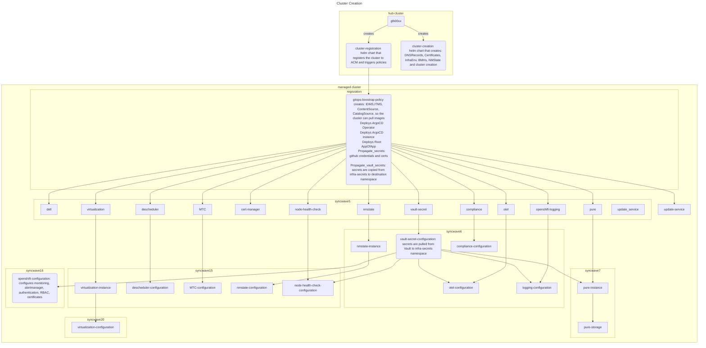

# Cluster Creation


The objective is to create clusters as much as possible in a declarative way.
In ACM this is possible by using the agent install in a similar way to what ZTP.
These are the logical steps

1. create [support for infraenvs](./components/acm-configuration/) and serving ISOs
2. create infraenv ([etl6 example](./clusters/hub/overlays/cluster-etl6/kustomization.yaml) and [bm cluster creation helm chart](.helm-charts/bm-cluster-agent-install/templates/infra-env.yaml))
3. create baremetal hosts inventory [etl6 example](./clusters/hub/overlays/cluster-etl6)
4. allow for the hosts to be discovered, this creates the Agents relative to the hosts.
6. create the cluster ([etl6 example](./clusters/hub/overlays/cluster-etl6/kustomization.yaml) and [bm cluster creation helm chart](.helm-charts/bm-cluster-agent-install/templates/agent-cluster-install.yaml))
7. register the cluster to ACM ([etl6 example](./clusters/hub/overlays/cluster-etl6/kustomization.yaml) and [registration helm chart](.helm-charts/cluster-registration/)


# Cluster Creation Process



```
---
title: Cluster Creation
---
flowchart TD
  venafi-auth-policy-configuration --> cert-manager-application
  cluster-registration --> openshift-gitops-operator
  github-auth-policy-configuration --> openshift-gitops-operator
  secured-cluster-policy --> acs-secured-configuration
  subgraph "on the ACM cluster"

 
    venafi-auth-policy-configuration(venafi-auth-policy-configuration 
      ACM policy that sends the venafi credentials to the managed clusters)
    github-auth-policy-configuration(github-auth-policy-configuration 
      ACM policy that sends the github credentials to the managed clusters)
    secured-cluster-policy(secured-cluster-policy 
      ACM policy that sends the ACS bundle to the managed clusters)
  end
  subgraph "on the Managed cluster"
    openshift-gitops-operator --> cert-manager-operator
    cert-manager-operator --> cert-manager-application(cert-manager-application
     runs a job to turn the venafi credentials into venafi token, 
     then configures the venafi cert issuer)
    cert-manager-application --> ingress-controller-configuration(ingress-controller-configuration 
      installs 53 cert on the cluster ingress)
    cert-manager-application --> openshift-api-certs-application(openshift-api-certs-application 
      installs 53 cert for the OCP API)
    openshift-api-certs-application --> vault-config-operator  
    vault-config-operator --> vault-configuration(vault-configuration 
      configures access to vault to extract infra secrets) 
    nmstate-operator --> nmstate-configuration(nmstate-configuration 
      allows access to storage network)
    namespace-config-operator --> namespace-configuration(namespace-configuration  
    deploys ESO secret store to infra namespaces)
    vault-configuration --> namespace-configuration
    external-secret-operator --> namespace-configuration
    powerflex-csm-operator --> powerflex-csm-configuration(powerflex-csm-configuration
      deploys CSI storage class for the cluster)
    namespace-configuration --> powerflex-csm-configuration
    nmstate-configuration --> powerflex-csm-configuration
    acs-operator --> acs-secured-configuration(acs-secured-configuration 
      registers the cluster to ACS)  
  end
