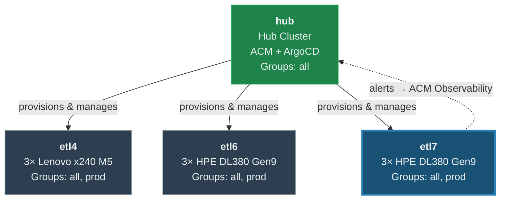
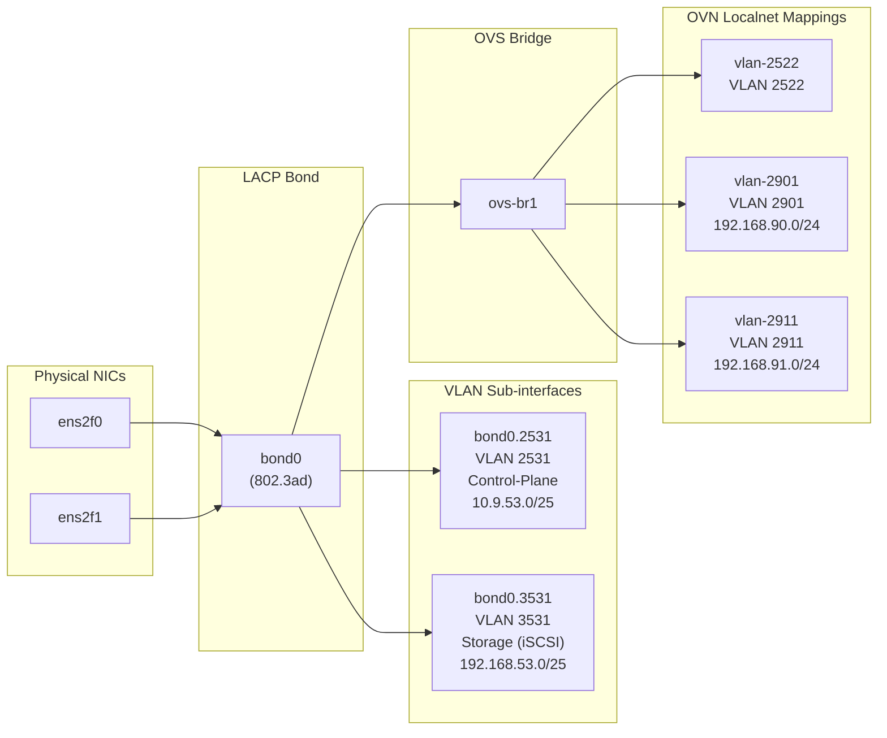
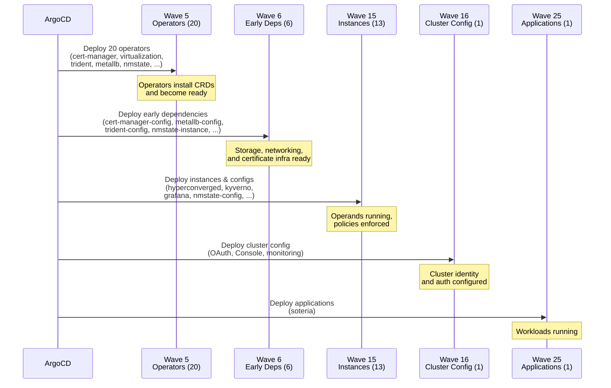

# etl7 — Low-Level Design Document

| Field | Value |
|-------|-------|
| **Cluster** | etl7 |
| **Role** | Managed |
| **OCP Version** | stable-4.22 (4.22.8) |
| **Date** | 2026-08-17 |
| **Generated From** | GitOps repository (virtualization-migration-factory) |

---

## Executive Summary

The **etl7** cluster is a managed OpenShift Container Platform 4.22 cluster operating as part of the virtualization migration factory fleet. It is a compact three-node bare-metal deployment running on HPE ProLiant DL380 Gen9 servers, where all nodes carry both control-plane and worker roles. The cluster is governed by Red Hat Advanced Cluster Management (ACM) from the central hub cluster and receives its entire configuration declaratively through a GitOps pipeline powered by ArgoCD.

etl7 belongs to both the **all** and **prod** cluster groups, giving it the full production-grade operator stack: OpenShift Virtualization for VM workload hosting, NetApp Astra Trident for iSCSI block storage, MetalLB for bare-metal load balancing, a complete observability stack (Cluster Observability Operator, Loki, Grafana, OpenTelemetry, Network Observability, Tempo), certificate automation via cert-manager, Kyverno policy enforcement, and node health remediation. The cluster hosts 41 active ArgoCD-managed components spanning operators, instances, configurations, and application workloads.

Storage is provided by a NetApp ONTAP SAN backend over iSCSI with thin provisioning, serving as the default virtualization storage class. Networking leverages LACP-bonded interfaces with VLAN segregation for control-plane, storage, and VM traffic, with an OVS bridge providing direct VLAN access to virtual machines via OVN-Kubernetes localnet topology. The cluster is installed and lifecycle-managed through ACM's agent-based install workflow using Redfish-based bare-metal provisioning.

---

## Multi-Cluster Architecture

The etl7 cluster is one of four clusters in the virtualization migration factory fleet. A central **hub** cluster running Red Hat Advanced Cluster Management orchestrates the lifecycle of three managed production clusters: **etl4**, **etl6**, and **etl7**. Each managed cluster is provisioned, configured, and governed from the hub via policy-based automation and GitOps delivery.

All managed clusters share the same group membership (`all` + `prod`) and receive an identical baseline operator stack, with cluster-specific customization applied through Kustomize overlays for networking (NMState, MetalLB IP pools), storage (Trident backend endpoints), and authentication. The hub cluster maintains provisioning manifests (BareMetalHost, NMState, FQDN entries) for each managed cluster in its overlay directories.

The fleet uses a single GitOps repository as the source of truth. ArgoCD instances on each cluster reconcile against this repository, with version pinning controlled through `cluster-versions.yaml`. Prometheus on etl7 forwards alerts to the hub's ACM Observability Alertmanager, establishing a centralized alerting pipeline.

---

## Cluster Identity

| Property | Value |
|----------|-------|
| Name | etl7 |
| Role | Managed (ACM-governed) |
| Base Domain | etl7.ocp.rht-labs.com |
| OCP Channel | stable-4.22 |
| Desired OCP Version | 4.22.8 |
| Git Version Pin | `main` |
| Groups | `all`, `prod` |
| Node Count | 3 (compact / converged) |
| Active Components | 41 |
| Cluster-Specific Overlays | 7 |

**Group contributions:**

| Group | Provides |
|-------|----------|
| `all` | Base infrastructure — GitOps, cert-manager, external-dns, MetalLB, NMState, Trident, Loki, logging, MinIO, kube-ops-view |
| `prod` | Production workloads — OpenShift Virtualization, Kyverno, Descheduler, Grafana, Network Observability, Node Health Check, Tempo, OpenTelemetry, ScyllaDB, Cluster Observability configuration |

---

## Compute & Node Inventory

etl7 is a **compact (converged) cluster** — all three nodes carry both `master` and `worker` roles. There are no dedicated worker nodes; the control-plane nodes are schedulable for workloads. The servers are HPE ProLiant DL380 Gen9 rack-mount servers (identified by the `dl380g9` hostname prefix).

| Hostname | FQDN | Role | BMC Address | BMC Protocol | Boot MAC | Status |
|----------|------|------|-------------|--------------|----------|--------|
| dl380g9-8 | dl380g9-8.etl7.ocp.rht-labs.com | master | 10.9.48.218 | Redfish | `00:11:0a:6b:b5:40` | Online |
| dl380g9-9 | dl380g9-9.etl7.ocp.rht-labs.com | master | 10.9.48.219 | Redfish | `00:11:0a:6a:65:b8` | Online |
| dl380g9-10 | dl380g9-10.etl7.ocp.rht-labs.com | master | 10.9.48.220 | Redfish | `00:11:0a:68:06:4c` | Online |

### NIC Inventory (per node)

Each node has six physical NICs. Two high-speed NICs (`ens2f0`, `ens2f1`) are bonded for all cluster traffic; four onboard NICs (`eno1`–`eno4`) are administratively down.

| Interface | Type | Role | State |
|-----------|------|------|-------|
| ens2f0 | Ethernet | Bond member (primary) | Up |
| ens2f1 | Ethernet | Bond member (secondary) | Up |
| eno1 | Ethernet | Unused (onboard) | Down |
| eno2 | Ethernet | Unused (onboard) | Down |
| eno3 | Ethernet | Unused (onboard) | Down |
| eno4 | Ethernet | Unused (onboard) | Down |

---

## Networking

### Installation Network

All cluster traffic at install time traverses a single LACP bond with VLAN-tagged sub-interfaces:

**Bond configuration:**

| Property | Value |
|----------|-------|
| Bond Name | bond0 |
| Mode | 802.3ad (LACP) |
| MII Monitor | 100 ms |
| Members | ens2f0, ens2f1 |

**VLAN assignments:**

| VLAN ID | Interface | Purpose | Subnet | Gateway |
|---------|-----------|---------|--------|---------|
| 2531 | bond0.2531 | Control-plane / API / Ingress | 10.9.53.0/25 | 10.9.53.1 |
| 3531 | bond0.3531 | Storage (iSCSI) | 192.168.53.0/25 | — |

**Per-node IP addressing:**

| Hostname | VLAN 2531 (Control-Plane) | VLAN 3531 (Storage) |
|----------|---------------------------|---------------------|
| dl380g9-8 | 10.9.53.18/25 | 192.168.53.18/25 |
| dl380g9-9 | 10.9.53.19/25 | 192.168.53.19/25 |
| dl380g9-10 | 10.9.53.20/25 | 192.168.53.20/25 |

**DNS servers:** 10.9.48.31, 10.9.48.32

**Default route:** 0.0.0.0/0 → 10.9.53.1 via bond0.2531

### Day-2 Network Configuration

Post-installation, an OVS bridge is configured via NodeNetworkConfigurationPolicy (NNCP) to provide direct VLAN access for virtual machines. The NNCP applies to all nodes matching the `node-role.kubernetes.io/worker` label (which, on this compact cluster, includes all three nodes).

**OVS Bridge:**

| Property | Value |
|----------|-------|
| Bridge Name | ovs-br1 |
| Purpose | Dedicated OVS bridge for VM VLAN traffic |
| Uplink Port | bond0 |
| STP | Disabled |
| Extra Patch Ports | Allowed |

**OVN Bridge Mappings (localnet):**

| Localnet Name | Bridge | VLAN ID | Subnet | Purpose |
|---------------|--------|---------|--------|---------|
| vlan-2522 | ovs-br1 | 2522 | — | VM network |
| vlan-2901 | ovs-br1 | 2901 | 192.168.90.0/24 | VM network |
| vlan-2911 | ovs-br1 | 2911 | 192.168.91.0/24 | VM network / iSCSI |

Each localnet mapping has a corresponding NetworkAttachmentDefinition (NAD) in the `default` namespace using the `ovn-k8s-cni-overlay` CNI plugin with `localnet` topology and MTU 1500. VMs can attach to these networks to gain direct Layer 2 access to the physical VLANs.

**Available but not enabled:** Per-node InfiniBand iSCSI bridge configurations (`linux-br-iscsi`) are defined in the NMState overlay but currently commented out. These would provision dedicated iSCSI bridges on VLAN 2911 with per-node IPs (192.168.91.8, 192.168.91.9, 192.168.91.10).

### MetalLB Load Balancer

| Property | Value |
|----------|-------|
| Pool Name | main-pool |
| Address Range | 10.9.53.32/28 (10.9.53.32–10.9.53.47, 16 addresses) |
| Auto Assign | Yes |
| Mode | Layer 2 |

### Network Summary

| Interface / VLAN | Purpose | Subnet | Nodes |
|------------------|---------|--------|-------|
| bond0 | LACP aggregate | — | All |
| bond0.2531 (VLAN 2531) | Control-plane, API, Ingress | 10.9.53.0/25 | All |
| bond0.3531 (VLAN 3531) | Storage (iSCSI to NetApp) | 192.168.53.0/25 | All |
| ovs-br1 | OVS bridge for VM traffic | — | All |
| vlan-2522 (localnet) | VM network | — | All |
| vlan-2901 (localnet) | VM network | 192.168.90.0/24 | All |
| vlan-2911 (localnet) | VM network / iSCSI | 192.168.91.0/24 | All |
| MetalLB main-pool | LoadBalancer Service VIPs | 10.9.53.32/28 | All |

### Network Topology Diagram

---

## Storage

The cluster uses **NetApp ONTAP SAN** as its primary storage backend, delivered via the **Astra Trident** CSI driver. Storage is accessed over iSCSI through VLAN 3531 (192.168.53.0/25).

**Backend configuration:**

| Property | Value |
|----------|-------|
| Backend Name | ontap-san |
| Driver | ontap-san (iSCSI) |
| Management LIF | netapp.etl.rht-labs.com |
| SVM | ocp_e7 |
| Credentials | Managed via GitOps (Secret: ontap-san-secret) |

**StorageClass:**

| StorageClass | Provisioner | Backend Type | Provisioning | Reclaim Policy | Volume Expansion | Snapshots | Clones | Default Virt Class |
|--------------|-------------|--------------|--------------|----------------|------------------|-----------|--------|-------------------|
| ontap-san | csi.trident.netapp.io | ontap-san | Thin | Delete | Yes | Yes | Yes | Yes |

The `ontap-san` StorageClass is annotated as the default virtualization storage class (`storageclass.kubevirt.io/is-default-virt-class: "true"`), meaning VM disks are provisioned on this backend by default. Thin provisioning with iSCSI block storage provides the RWX access mode required for live migration of virtual machines.

---

## Installation Method

etl7 is deployed via **ACM agent-based install** from the hub cluster. The hub maintains the full set of provisioning manifests in `clusters/hub/overlays/cluster-etl7/`.

| Property | Value |
|----------|-------|
| Method | Agent-based install (ACM) |
| BMC Protocol | Redfish (`redfish://` endpoints) |
| Boot Method | Virtual media (Redfish virtual media) |
| Hub Overlay | `clusters/hub/overlays/cluster-etl7/` |

**Provisioning artifacts on hub:**

| Resource | Count | Purpose |
|----------|-------|---------|
| BareMetalHost | 3 | One per node — BMC credentials, MAC, boot configuration |
| NMState Config | 3 | Per-node network configuration applied during install |
| FQDN Entry | 3 | DNS hostname entries for each node |
| Namespace | 1 | Cluster namespace on hub |
| Pull Secret | 1 | Container registry pull credentials |
| BMC Credentials Secret | 1 | Shared BMC credentials for all nodes |

The agent-based install flow works as follows: ACM creates an InfraEnv and AgentClusterInstall on the hub, the BareMetalHost CRs trigger Redfish-based virtual media boot on each server, the agent discovers the hardware and reports back, and ACM orchestrates the OpenShift installation across all three nodes simultaneously.

---

## Operator Stack

All operators are deployed via **OperatorPolicy** (ACM policy-based lifecycle), not traditional OLM Subscriptions. This provides centralized governance and version control from the hub cluster. The following table lists operators with parsed OperatorPolicy data:

### Wave 5 — Operators

| Operator | Package | Channel | Source | Namespace | Starting CSV | Upgrade |
|----------|---------|---------|--------|-----------|--------------|---------|
| cert-manager-operator | openshift-cert-manager-operator | stable-v1 | redhat-operators | cert-manager | v1.17.0 | Automatic |
| cluster-observability-operator | cluster-observability-operator | stable | redhat-operators | openshift-operators | v1.0.0 | Automatic |
| descheduler-operator | cluster-kube-descheduler-operator | stable | redhat-operators | openshift-kube-descheduler-operator | v5.1.1 | Automatic |
| external-dns-operator | external-dns-operator | stable-v1 | redhat-operators | external-dns-operator | v1.3.0 | Automatic |
| kyverno-operator | — | — | — | — | — | — |
| loki-operator | loki-operator | stable-6.6 | redhat-operators | openshift-loki-operator | v6.3.0 | Automatic |
| metallb-operator | metallb-operator | stable | redhat-operators | metallb-system | v4.20.0 | Automatic |
| minio-operator | — | — | — | — | — | — |
| network-observability-operator | netobserv-operator | stable | redhat-operators | openshift-netobserv-operator | v1.12.0 | Automatic |
| nmstate-operator | kubernetes-nmstate-operator | stable | redhat-operators | openshift-nmstate | v4.19.0 | Automatic |
| node-health-check-operator | — | — | — | — | — | — |
| openshift-gitops-operator | openshift-gitops-operator | latest | redhat-operators | openshift-gitops-operator | v1.20.4 | Automatic |
| openshift-grafana-operator | — | — | — | — | — | — |
| openshift-logging-operator | cluster-logging | stable-6.6 | redhat-operators | openshift-logging | v6.3.0 | Automatic |
| openshift-tempo-operator | — | — | — | — | — | — |
| openshift-virtualization | kubevirt-hyperconverged | stable | redhat-operators | openshift-cnv | v4.20.11 | Automatic |
| otel-operator | — | — | — | — | — | — |
| scylladb-operator | scylladb-operator | stable | certified-operators | scylladb | v1.20.2 | Automatic |
| trident-operator | trident-operator | stable | certified-operators | netapp-trident | v25.6.1 | Automatic |

> Operators marked with "—" are deployed via the group values.yaml but their OperatorPolicy files were not parsed (they may use community-operator catalogs or alternative deployment mechanisms).

### Wave 6 — Early Dependencies

| Component | Source | Has Overlay | Purpose |
|-----------|--------|-------------|---------|
| cert-manager-configuration | group:all | No | TLS certificate issuance via Let's Encrypt / DNS-01 |
| external-dns-configuration | group:all | No | DNS record management via RFC 2136 |
| metallb-configuration | cluster-specific | Yes | MetalLB IP address pool (10.9.53.32/28) |
| nmstate-instance | group:all | No | NMState operator instance |
| trident-configuration | cluster-specific | Yes | NetApp ONTAP-SAN backend + StorageClass |
| trident-instance | group:all | No | Trident orchestrator instance |

### Wave 15 — Instances & Configurations

| Component | Source | Has Overlay | Purpose |
|-----------|--------|-------------|---------|
| cluster-observability-configuration | group:prod | No | Observability stack configuration |
| descheduler-configuration | group:prod | No | Pod eviction policies for balanced scheduling |
| hyperconverged-instance | group:prod | No | OpenShift Virtualization HyperConverged CR |
| kube-ops-view | group:all | No | Cluster operations visualization dashboard |
| kyverno-configuration | group:prod | No | Policy enforcement rules |
| loki-logging-configuration | group:all | No | Loki log aggregation configuration |
| network-observability-configuration | group:prod | No | Network flow observability |
| nmstate-configuration | cluster-specific | Yes | Day-2 NMState: OVS bridge + OVN bridge mappings |
| node-health-check-configuration | group:prod | No | Automated node health remediation |
| openshift-gitops-configuration | group:all | No | ArgoCD instance configuration |
| openshift-logging-configuration | group:all | No | Cluster log forwarding configuration |
| openshift-tempo-instance | group:prod | No | Distributed tracing backend |
| user-workload-grafana-instance | group:prod | No | Grafana dashboards for user workloads |

### Wave 16 — Cluster Configuration

| Component | Source | Has Overlay | Purpose |
|-----------|--------|-------------|---------|
| openshift-config | cluster-specific | Yes | OAuth, ClusterVersion, Console plugins, monitoring config, network config |

### Wave 25 — Applications

| Component | Source | Has Overlay | Purpose |
|-----------|--------|-------------|---------|
| soteria | cluster-specific | No | Application workload |

### Console Plugins

The OpenShift Console is configured with the following plugins:

| Plugin | Purpose |
|--------|---------|
| monitoring-plugin | Monitoring dashboards |
| gitops-plugin | ArgoCD integration |
| kubevirt-plugin | Virtual machine management |
| nmstate-console-plugin | Network state visualization |
| node-remediation-console-plugin | Node health remediation UI |
| networking-console-plugin | Network configuration UI |
| logging-view-plugin | Log viewer |
| soteria-console-plugin | Soteria application UI |
| netobserv-plugin | Network observability flows |

---

## Observability

etl7 runs a comprehensive observability stack spanning metrics, logging, tracing, and network flow analysis.

### Monitoring & Metrics

The cluster monitoring stack is customized via `cluster-monitoring-config` ConfigMap with the following key settings:

| Component | CPU Request | Memory Request | Memory Limit | Notes |
|-----------|-------------|----------------|--------------|-------|
| Prometheus (prometheusK8s) | 200m | 8Gi | 32Gi | 100Gi persistent storage on `ontap-nas` |
| Alertmanager | 200m | 500Mi | 1Gi | |
| Kube State Metrics | 200m | 500Mi | 1Gi | |
| OpenShift State Metrics | 200m | 500Mi | 1Gi | |
| Prometheus Operator | 200m | 500Mi | 1Gi | |
| Thanos Querier | 200m | 500Mi | 1Gi | |
| Monitoring Plugin | 200m | 500Mi | 1Gi | |
| Telemeter Client | 200m | 500Mi | 1Gi | |
| Metrics Server | 10m | 50Mi | 500Mi | |
| Node Exporter | 20m | 50Mi | 150Mi | Extended collectors enabled |
| Prometheus Operator Webhook | 20m | 50Mi | 100Mi | |

**User workload monitoring** is enabled (`enableUserWorkload: true`), allowing application teams to define custom ServiceMonitors and PrometheusRules.

**Node Exporter** runs with extended collector set: buddyinfo, cpufreq, ksmd, mountstats, netclass, netdev, processes, systemd, tcpstat.

### Multi-Cluster Alert Forwarding

Prometheus on etl7 is configured with an **additional Alertmanager** target pointing to the hub cluster's ACM Observability Alertmanager:

| Property | Value |
|----------|-------|
| Target | `alertmanager-open-cluster-management-observability.apps.hub2.ocp.rht-labs.com` |
| Protocol | HTTPS (API v2) |
| Authentication | Bearer token (managed via reflector-propagated secrets) |
| TLS | CA-verified (hub-alertmanager-router-ca) |
| Cluster Label | `managed_cluster: 57ad5a67-2446-457c-992b-a3e05269b7ec` |

### Logging

- **Loki Operator** provides log aggregation with MinIO as the object storage backend.
- **OpenShift Logging Operator** (cluster-logging v6.x) handles log collection and forwarding.

### Tracing

- **OpenShift Tempo** provides distributed tracing storage.
- **OpenTelemetry Operator** handles telemetry collection and export.

### Network Observability

- **Network Observability Operator** (netobserv) captures eBPF-based network flow data for traffic analysis and troubleshooting.

### Dashboards

- **Grafana Operator** with `user-workload-grafana-instance` provides custom dashboards for user workloads.
- **Cluster Observability Operator** manages the unified observability configuration.
- **kube-ops-view** provides a real-time cluster operations visualization.

---

## Authentication & Authorization

| Provider | Type | Mapping Method | Notes |
|----------|------|----------------|-------|
| htpasswd | HTPasswd | claim | File-based authentication via `htpass-secret` |

The cluster currently uses **HTPasswd** as its sole identity provider. The `htpass-secret` Secret in the `openshift-config` namespace must be created manually (not managed via GitOps to avoid committing credentials).

> **Recommendation:** HTPasswd is suitable for lab and development environments. For production use, consider integrating an enterprise identity provider (OIDC / LDAP / Active Directory) for centralized authentication and audit compliance.

---

## Cluster Upgrades

| Property | Value |
|----------|-------|
| OCP Channel | stable-4.22 |
| Current Desired Version | 4.22.8 |
| Git Version Pin | `main` (tracks latest) |
| OVN Route Advertisements | Disabled |

### Operator Upgrade Policies

All operators with parsed OperatorPolicy data use **Automatic** upgrade approval. This means operators will automatically upgrade within their subscribed channel when new versions are published to the catalog.

| Operator | Upgrade Approval | Channel | Pinned CSV | Latest Allowed |
|----------|-----------------|---------|------------|----------------|
| cert-manager-operator | Automatic | stable-v1 | v1.17.0 | v1.20.0 |
| cluster-observability-operator | Automatic | stable | v1.0.0 | v1.5.1 |
| descheduler-operator | Automatic | stable | v5.1.1 | v5.4.0 |
| external-dns-operator | Automatic | stable-v1 | v1.3.0 | v1.3.8 |
| loki-operator | Automatic | stable-6.6 | v6.3.0 | v6.6.0 |
| metallb-operator | Automatic | stable | v4.20.0 | v4.22.0 |
| network-observability-operator | Automatic | stable | v1.12.0 | v1.12.1 |
| nmstate-operator | Automatic | stable | v4.19.0 | v4.22.0 |
| openshift-gitops-operator | Automatic | latest | v1.20.4 | v1.21.1 |
| openshift-logging-operator | Automatic | stable-6.6 | v6.3.0 | v6.6.0 |
| openshift-virtualization | Automatic | stable | v4.20.11 | v4.22.2 |
| scylladb-operator | Automatic | stable | v1.20.2 | v1.20.2 |
| trident-operator | Automatic | stable | v25.6.1 | v26.6.0 |

### Upgrade Recommendations

1. **Control plane first:** Upgrade OCP via the stable-4.22 channel, allowing the cluster to roll through master nodes sequentially (compact cluster — no dedicated workers to drain).
2. **Operator coordination:** With Automatic approval, operators will upgrade on their own schedule. Monitor for compatibility with the target OCP version before initiating a control-plane upgrade.
3. **Storage driver:** Trident has a wide version spread (v25.6.1 → v26.6.0). Verify NetApp compatibility matrices before allowing major Trident version jumps.
4. **Version pinning:** The git version pin is set to `main`, meaning ArgoCD tracks the HEAD of the main branch. For production stability, consider pinning to a specific commit or tag.

---

## Component Deployment Sequence

The full deployment sequence is ordered by ArgoCD sync-wave. Components within the same wave deploy in parallel.

| Wave | Component | Source | Has Overlay | Purpose |
|------|-----------|--------|-------------|---------|
| 5 | cert-manager-operator | group:all | No | TLS certificate operator |
| 5 | cluster-observability-operator | group:all | No | Unified observability operator |
| 5 | descheduler-operator | group:prod | No | Pod descheduling operator |
| 5 | external-dns-operator | group:all | No | DNS record automation operator |
| 5 | kyverno-operator | group:prod | No | Policy enforcement operator |
| 5 | loki-operator | group:all | No | Log aggregation operator |
| 5 | metallb-operator | group:all | No | Bare-metal load balancer operator |
| 5 | minio-operator | group:all | No | Object storage operator (Loki backend) |
| 5 | network-observability-operator | group:prod | No | Network flow analysis operator |
| 5 | nmstate-operator | group:all | No | Node network state operator |
| 5 | node-health-check-operator | group:prod | No | Automated node remediation operator |
| 5 | openshift-gitops-operator | group:all | No | ArgoCD / GitOps operator |
| 5 | openshift-grafana-operator | group:prod | No | Grafana dashboards operator |
| 5 | openshift-logging-operator | group:all | No | Cluster logging operator |
| 5 | openshift-tempo-operator | group:prod | No | Distributed tracing operator |
| 5 | openshift-virtualization | group:prod | No | KubeVirt / VM management operator |
| 5 | otel-configuration | group:prod | No | OpenTelemetry configuration |
| 5 | otel-operator | group:prod | No | OpenTelemetry operator |
| 5 | scylladb-operator | group:prod | No | ScyllaDB database operator |
| 5 | trident-operator | group:all | No | NetApp Astra Trident CSI operator |
| 6 | cert-manager-configuration | group:all | No | Certificate issuers + Let's Encrypt |
| 6 | external-dns-configuration | group:all | No | ExternalDNS RFC 2136 configuration |
| 6 | metallb-configuration | cluster-specific | Yes | IP address pool: 10.9.53.32/28 |
| 6 | nmstate-instance | group:all | No | NMState operator instance CR |
| 6 | trident-configuration | cluster-specific | Yes | ONTAP-SAN backend + StorageClass |
| 6 | trident-instance | group:all | No | Trident orchestrator CR |
| 15 | cluster-observability-configuration | group:prod | No | Observability stack setup |
| 15 | descheduler-configuration | group:prod | No | Descheduler eviction policies |
| 15 | hyperconverged-instance | group:prod | No | HyperConverged CR for virtualization |
| 15 | kube-ops-view | group:all | No | Cluster visualization dashboard |
| 15 | kyverno-configuration | group:prod | No | Kyverno policy rules |
| 15 | loki-logging-configuration | group:all | No | Loki stack configuration |
| 15 | network-observability-configuration | group:prod | No | FlowCollector + dashboards |
| 15 | nmstate-configuration | cluster-specific | Yes | OVS bridge + OVN localnet mappings |
| 15 | node-health-check-configuration | group:prod | No | NodeHealthCheck CRs |
| 15 | openshift-gitops-configuration | group:all | No | ArgoCD instance settings |
| 15 | openshift-logging-configuration | group:all | No | ClusterLogForwarder |
| 15 | openshift-tempo-instance | group:prod | No | TempoStack CR |
| 15 | user-workload-grafana-instance | group:prod | No | Grafana dashboards |
| 16 | openshift-config | cluster-specific | Yes | OAuth, ClusterVersion, Console, monitoring, network |
| 25 | soteria | cluster-specific | No | Application workload |

**Total:** 41 components (20 at wave 5, 6 at wave 6, 13 at wave 15, 1 at wave 16, 1 at wave 25)

---

## Design Decisions

| ID | Topic | Decision | Rationale |
|----|-------|----------|-----------|
| DD-01 | Cluster topology | Compact 3-node converged cluster (masters schedulable) | Reduces hardware footprint for environments where workload density permits co-location of control-plane and workloads. Aligns with Red Hat's supported compact cluster topology. |
| DD-02 | Storage driver | NetApp ONTAP-SAN (iSCSI) with thin provisioning | Block storage over iSCSI provides the performance characteristics needed for VM disk I/O. Thin provisioning optimizes capacity utilization. The `ontap-san` driver supports RWX via iSCSI multipath, enabling VM live migration. |
| DD-03 | Default virt storage class | `ontap-san` marked as default virtualization StorageClass | Ensures VMs get provisioned on the purpose-built SAN backend by default without requiring per-VM storage annotations. |
| DD-04 | Network topology | Dedicated OVS bridge (ovs-br1) for VM VLAN traffic | Separates VM network traffic from cluster control-plane traffic. VMs access physical VLANs directly via OVN localnet, providing near-native network performance and supporting existing VLAN-based network segmentation. |
| DD-05 | Bonding mode | LACP (802.3ad) with 100ms MII monitoring | Provides link aggregation for throughput and redundancy. Requires switch-side LACP configuration but delivers predictable load distribution. |
| DD-06 | Network segregation | Separate VLANs for control-plane (2531), storage (3531), and VM traffic (2522, 2901, 2911) | Isolates traffic domains for performance predictability and security. Storage traffic (iSCSI) on its own VLAN prevents contention with API/ingress traffic. |
| DD-07 | Authentication | HTPasswd identity provider | Simple, file-based authentication suitable for lab/development. Should be migrated to OIDC or LDAP for production with enterprise audit requirements. |
| DD-08 | Operator lifecycle | ACM OperatorPolicy with Automatic upgrade approval | Centralized operator governance from the hub. Automatic approval minimizes operational toil for non-breaking updates within stable channels. |
| DD-09 | OCP upgrade channel | stable-4.22 | The stable channel provides tested, production-quality updates. Avoids the risk profile of fast/candidate channels while staying current. |
| DD-10 | Installation method | ACM agent-based install with Redfish virtual media | Zero-touch provisioning without PXE infrastructure. Redfish virtual media boots the discovery ISO directly from BMC, simplifying the network boot requirements. |
| DD-11 | Monitoring persistence | Prometheus with 100Gi PVC on `ontap-nas` | Persistent metrics storage survives pod restarts and node failures. NAS-backed (not SAN) to separate metrics I/O from workload storage paths. |
| DD-12 | Multi-cluster alerting | Prometheus alert forwarding to hub ACM Observability | Centralizes alert management at the fleet level. Enables correlation of alerts across clusters and unified notification routing. |
| DD-13 | Git version pin | `main` branch (HEAD tracking) | Simplifies continuous delivery — merged changes auto-deploy. Acceptable for environments with CI gating on the main branch. Consider tag-based pinning for stricter change control. |
| DD-14 | Load balancer | MetalLB Layer 2 with /28 address pool | Provides 16 external IPs for LoadBalancer Services on bare-metal (no cloud provider LB). Layer 2 mode requires no BGP configuration and works with any network infrastructure. |
| DD-15 | Policy enforcement | Kyverno for cluster-wide policies | Kyverno provides Kubernetes-native policy enforcement with a lower barrier to entry than OPA/Gatekeeper. Policies are expressed as Kubernetes resources. |

---

## References

- [OpenShift Container Platform 4.22 Documentation](https://docs.redhat.com/en/documentation/openshift_container_platform/4.22)
- [OpenShift Virtualization 4.22](https://docs.redhat.com/en/documentation/openshift_container_platform/4.22/html/virtualization)
- [Red Hat Advanced Cluster Management for Kubernetes](https://docs.redhat.com/en/documentation/red_hat_advanced_cluster_management_for_kubernetes)
- [NetApp Astra Trident Documentation](https://docs.netapp.com/us-en/trident/)
- [MetalLB Operator — OpenShift 4.22](https://docs.redhat.com/en/documentation/openshift_container_platform/4.22/html/networking_operators/metallb-operator)
- [NMState Operator — OpenShift 4.22](https://docs.redhat.com/en/documentation/openshift_container_platform/4.22/html/networking_operators/kubernetes-nmstate)
- [cert-manager Operator for OpenShift](https://docs.redhat.com/en/documentation/openshift_container_platform/4.22/html/security_and_compliance/cert-manager-operator-for-red-hat-openshift)
- [OpenShift Logging 6.x](https://docs.redhat.com/en/documentation/openshift_container_platform/4.22/html/logging)
- [Kyverno Policy Engine](https://kyverno.io/docs/)
- [NMState YAML API Reference](https://nmstate.io/devel/yaml_api.html)
- [OpenShift Agent-Based Install](https://docs.redhat.com/en/documentation/openshift_container_platform/4.22/html/installing_an_on-premise_cluster_with_the_agent-based_installer)
