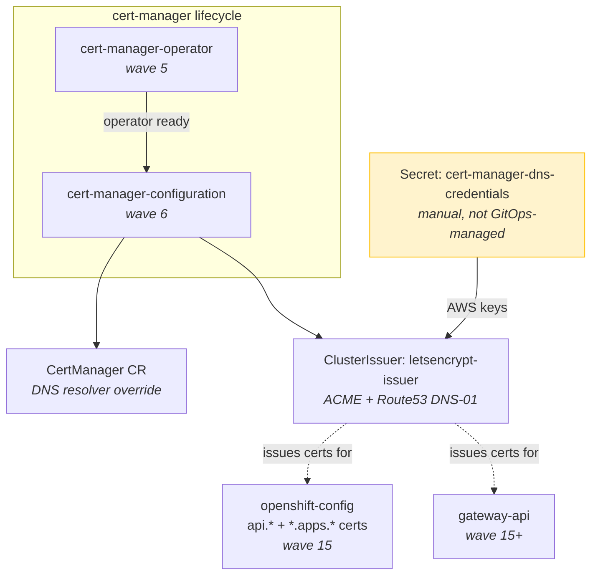
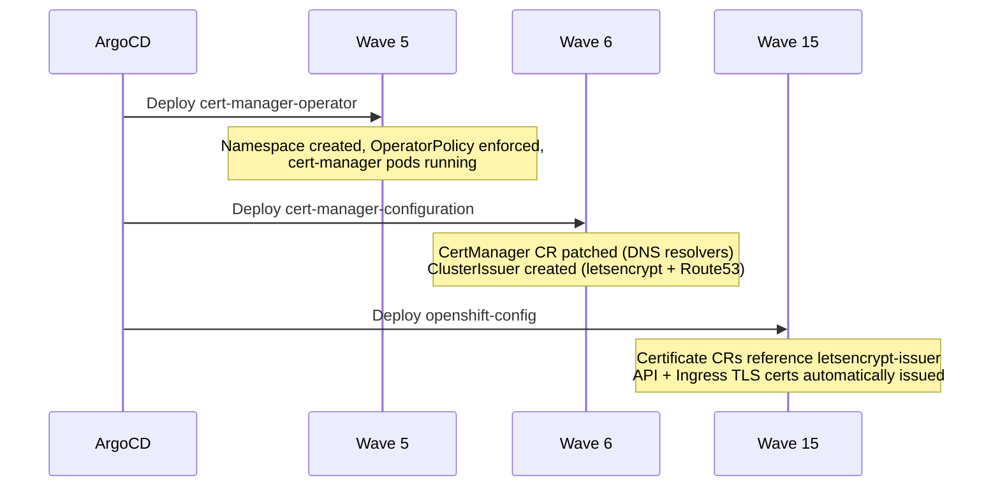

# cert-manager

Automates TLS certificate issuance and renewal across the fleet using Let's Encrypt with DNS-01 validation via AWS Route53.

## Upstream Project

- **Product:** Red Hat cert-manager Operator for OpenShift
- **Documentation:** https://docs.openshift.com/container-platform/latest/security/cert_manager_operator/index.html
- **Upstream:** https://cert-manager.io/docs/
- **Operator:** `openshift-cert-manager-operator`
- **Channel:** `stable-v1`
- **Source:** `redhat-operators`

## Lifecycle Parts

| Part | Sync-Wave | Purpose |
|------|-----------|---------|
| `cert-manager-operator` | 5 | Deploys the cert-manager operator and creates the `cert-manager` namespace |
| `cert-manager-configuration` | 6 | Creates the Let's Encrypt ClusterIssuer and patches DNS resolver settings |

Wave 6 (not default 15) because `openshift-config` and other wave-15 components depend on the ClusterIssuer to mint certificates.

## Configuration

**DNS resolver override** — The CertManager CR is patched to use external resolvers (8.8.8.8, 1.1.1.1) exclusively for DNS-01 challenges. Without this, the cluster's internal DNS would attempt to resolve ACME challenge TXT records before they propagate publicly, causing validation failures.

**ClusterIssuer: `letsencrypt-issuer`** — Production ACME server with DNS-01 solver via AWS Route53. Requires a manually-created Secret:

```sh
oc apply -f ./aws-secret.yaml -n cert-manager
```

The Secret `cert-manager-dns-credentials` must contain `aws_access_key_id` and `aws_secret_access_key` for an IAM user/role with Route53 permissions on hosted zone `Z0244679K5IT10T4RPI1`.

## Architecture



## Deployment Sequence



## Cluster Deployment

| Cluster | Source |
|---------|--------|
| All clusters (hub, etl4, etl6, etl7) | `groups/all` |

## Dependencies

**Depended on by:**
- `openshift-config` (wave 15) — mints API and ingress wildcard TLS certificates
- `gateway-api` — gateway TLS certificates
- `bookinfo` — sample app certificates
- Any component requesting a `Certificate` CR referencing `letsencrypt-issuer`

**Depends on:**
- AWS Route53 DNS zone access (external dependency, not a repo component)

## Customization Points

No cluster-specific overlays exist for cert-manager currently. Potential customizations:
- Additional ClusterIssuers (e.g. internal CA for non-public services)
- Different DNS providers per cluster (if clusters use different DNS zones)
